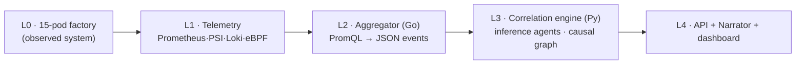

# SiliconKnights Edge Causal AIOps Tool for Kubernetes

Building for ABB Accelerator 2026, Theme 2:
**Beyond monitoring: AI agents for real-time pod resource discovery and dependency mapping**

**Program overview**  
This project invites young innovators to rethink how containerized systems are understood, not just monitored. This challenge offers an opportunity to explore AI-driven approaches that analyze, correlate, and interpret real-time pod behavior. Participants will uncover dependencies, detect anomalies, and generate meaningful insights. It provides an opportunity to solve real-world infrastructure challenges using modern orchestration environments.

**Problem statement**  
Build a container-based automation solution of your choice (like smart solutions for your university or your town).  

The application should have container orchestration platforms — Kubernetes, K3s, MicroK8s, and other lightweight environments, and enable rapid deployment of microservices. But as applications scale, even single-node deployments often host hundreds of pods across multiple namespaces, each with diverse resource patterns including CPU, memory, disk, network usage, and PVC operations.

**Stakeholders**  

- **Engineers** managing containerized environments 
- **Platform/system operators** working with Kubernetes and similar tools
- **Organizations** relying on these systems for performance and reliability
- **Communities** adopting this system to improve efficiency

**Current workarounds**  
While these platforms provide raw metrics, correlating, resource behavior is still extremely challenging, especially when dealing with:  

- Bursty workloads
- Large file I/O
- PVC-based storage stress
- Multi-service dependency behavior
- Sudden anomalies or leaks  

Engineers struggle to answer foundational operational questions such as:  

- Which pod is causing unexpected CPU spikes?
- How are PVC I/O patterns linked to pod restarts?
- Are different services influencing each other’s resource consumption?
- Which workloads need optimization?  

There is currently no unified tool providing real-time, AI-driven correlation across all these resource types in single-node clusters commonly used in edge and industrial environments.

**Desired solution**  
The system must collect, analyze, and correlate real-time resource consumption of pods across all namespaces in a single-node environment. Key capabilities include:  

- Real-time resource discovery (CPU, RAM, disk usage, PVC metrics, network data)
- Multi-agent AI analysis across CPU, Memory, Storage/PVC, and Log/IO
- Interdependency mapping to identify relationships between pods
- Intelligent recommendations for optimization, alerts, and forecasting
- Rich real-time dashboard with graphs, correlations, anomaly timelines, and NLP insights

**Impact and benefits**  
**Impact**  

- A fully running prototype on Minikube, MicroK8s, K3s, or any other orchestration
- Multi-agent AI analysis framework
- Real-time visualization dashboard
- Live demo of insights and interdependency detection
- Technical report describing architecture, pipelines, and methodology

**Benefits**  
- Provides real-time visibility into pod-level resource behavior, preventing performance degradation and downtime
- Improves reliability through AI-driven anomaly detection, bottleneck identification, and dependency understanding


**Status**

All five layers (L0–L4) are built and running on the cluster. Detection is deviation-based against a learned per-pod baseline, so steady state is silent (S0) and only real excursions register; on scenario S1 the engine attributes shared-disk I/O contention to its source (cooling-monitor) via a per-pod write signal, with a threshold-free causal edge to the victim (timescaledb), ranked by explanatory reach and confirmed by temporal precedence, and persisted as a reusable case family. The engine is multi-signal (psi_io / psi_cpu / psi_mem) and carries an OOM forecaster (working_set → limit) and a deterministic right-sizing + fairness pass (PS-Q4). The L4 layer is a local **gemma4** narrator (`/api/narrative`, deterministic template fallback) and a Next.js dashboard with a **3D causal graph over the eBPF-discovered topology**, an AI insight feed, recommendations, an embedded Grafana PSI panel, and a scenario console (S1/S2/S5 fire + reset), reachable over Tailscale. Demonstrable today: S0 silent, S1 disk-causality cascade, S5 OOM forecast, topology, and recommendations. See the status table below.

---

## Overview

The system observes per-pod resource behaviour across all namespaces on a single-node cluster and attributes observed degradation to a likely root cause. Detection operates on kernel-level signals (PSI, cgroup metrics, eBPF) and does not require any modification or instrumentation of the observed applications. It is intended to answer four operational questions:

1. Which pod is causing unexpected CPU spikes?
2. How are PVC I/O patterns linked to pod restarts?
3. Are different services influencing each other's resource consumption?
4. Which workloads need optimization?

## Architecture (L0 to L4)



**L0, factory (observed system).** A 15-pod synthetic factory (MQTT telemetry, TimescaleDB, and cooling, vision, and control services) that reproduces representative failure classes (CPU throttling, page-cache writeback, fsync storms, OOM termination) using real kernel mechanisms rather than injected metric values.

**L1, telemetry.** Prometheus scrapes the factory namespaces every 5 seconds. Signals include kubelet cAdvisor metrics with Pressure Stall Information (PSI), kube-state-metrics, node-exporter, and eBPF-discovered service flows (Caretta). Container logs (Loki / Grafana Alloy) are partial. No application instrumentation is required.

**L2, aggregator (Go).** Queries Prometheus on a fixed interval, normalizes the results into a schema-stable JSON event format, applies deterministic threshold rules (an alert hint only), and serves a 15-minute per-pod history at `/window`.

**L3, correlation engine (Python).** Detection is **deviation-based**: each pod's PSI is judged against its own learned steady-state baseline, so normal factory load stays silent (S0) and only genuine excursions become findings. The disturbance is located across the full ring, then correlation is centred on it. Edges are admitted by statistical strength (**positive** coupling) + a physical witness (shared volume / eBPF link; PSI only corroborates) + temporal order — no resource thresholds. The **source** of a disk storm is identified from a per-pod **write** signal (`io_write`): the dominant writer that actually deviated, oriented writer→staller (PSI alone sees only victims). Root cause is ranked by explanatory reach, with blast-radius forecasting. Permanent SQLite memory on `engine-memory-pvc` holds **workload-keyed** edge confidence with a learned structural baseline, similarity-merged **case families**, model versions, and mistake records — all surviving the 14-day telemetry window. No language model is used in this stage. (Stateful-engine design: see `DESIGN_stateful_engine_and_case_library.md`.)

**L4, API + language + dashboard.** A FastAPI gateway (`api/`) exposes the verdict as frontend-agnostic JSON; a local model (Ollama) renders it into prose with a deterministic fallback; the dashboard presents the 3D causal graph over the discovered topology, recommendations, an AI insight feed, an embedded Grafana PSI panel, and a scenario console.

## Repository layout

| Path | Contents |
|------|----------|
| `workloads/` | 15 L0 pod sources and Dockerfiles |
| `deploy/` | Helm umbrella chart (`charts/factory`), `skctl` bootstrap, Prometheus/Loki values, `slowdisk.yaml`, L2/L3/L4 manifests |
| `aggregator/` | L2 Go service, frozen `event.schema.json`, PromQL pack |
| `correlation/` | L3 engine (`detectors`, `lagcorr`, `gate`, `ranking`, `pipeline`, persistent `state`), `service.py`, unit tests |
| `api/` | L4 frontend-agnostic API gateway (FastAPI) |
| `scenarios/` | S0–S5 triggers, runbooks, rehearsal ledger |
| `appendix/` | Operational scripts (`verify_taps`, `diag_scrape`, `component_check`, `restart_test`, `psi_watch`) |
| `MASTER_PLAN`, `EXPLANATIONS`, `QUICKSTART`, `DESIGN_*` | architecture, code map, clone-to-running guide, stateful-engine design |

## Prerequisites

A real Linux kernel — bare metal or a full VM. **WSL2 is not supported** (no per-pod PSI). Ubuntu/Xubuntu 24.04+, kernel 5.15+, 16 GB RAM, ~64 GB free disk for the 14-day TimescaleDB window. Confirm the kernel gate — all five must pass:

```bash
uname -r                         # >= 5.15  (24.04 ships 6.8+)
ls /sys/kernel/btf/vmlinux       # exists      (eBPF CO-RE)
stat -fc %T /sys/fs/cgroup       # cgroup2fs
cat /proc/pressure/cpu           # 'some'/'full' lines present  (PSI on)
timedatectl | grep synchronized  # yes         (the lag engine needs a synced clock)
```

Toolchain:

```bash
sudo apt update && sudo apt install -y docker.io git make curl
sudo usermod -aG docker $USER && newgrp docker
sudo snap install helm --classic
```

K3s with the PSI feature gate (the kubelet-arg is required):

```bash
curl -sfL https://get.k3s.io | INSTALL_K3S_EXEC="--disable traefik --kubelet-arg=feature-gates=KubeletPSI=true" sh -
mkdir -p ~/.kube && sudo cp /etc/rancher/k3s/k3s.yaml ~/.kube/config && sudo chown $USER ~/.kube/config
echo 'export KUBECONFIG=$HOME/.kube/config' >> ~/.bashrc && export KUBECONFIG=$HOME/.kube/config
kubectl get nodes        # Ready
# confirm per-pod PSI is scrapeable (the whole differentiator):
kubectl get --raw "/api/v1/nodes/$(kubectl get no -o name | cut -d/ -f2)/proxy/metrics/cadvisor" | grep -m1 container_pressure
```

## Build and deploy

Images are built per workload and imported into the K3s runtime (registry prefix/tag `skn/<name>:v0.1`, from chart values — no registry needed at runtime).

```bash
git clone https://github.com/GreaseMonkeyIT/ABB_Accelerator_Submission.git && cd ABB_Accelerator_Submission
chmod +x deploy/skctl appendix/*.sh scenarios/*/*.sh   # restore exec bits (harmless if already set)

make test            # optional: engine pytest (47/47) + aggregator go test
make images          # docker build 15 workloads + aggregator/engine/api/dashboard
make import          # build + import all images into k3s containerd
make charts          # helm lint + template the factory chart
./deploy/skctl up --mode solo
```

`make import` and `skctl up` are both idempotent — re-run after any change.

**Storage.** The two factory PVCs (`tsdb-pvc`, `shared-logs-pvc`) bind to a `slowdisk` StorageClass — static local PVs on a dedicated HDD, which keeps the S1/S2 disk contention realistic (D-014). **`skctl up` does not create these**, so set storage up first:

- **Reference box (dedicated HDD):** prep the HDD (see the header of `deploy/slowdisk.yaml`), then apply the static PVs **before** `skctl up`:
  ```bash
  NODE=$(kubectl get node -o jsonpath='{.items[0].metadata.labels.kubernetes\.io/hostname}')
  sed "s/<NODE_NAME>/$NODE/g" deploy/slowdisk.yaml | kubectl apply -f -
  ```
  These PVs use `Retain`: after a teardown that deletes the PVCs they go `Released` and won't rebind — `kubectl delete pv tsdb-pv-slowdisk shared-logs-pv-slowdisk` and re-apply the line above before redeploying.
- **Plain single-disk PC:** skip slowdisk — set both `storageClass: slowdisk` → `local-path` under `pvcs:` in `deploy/charts/factory/values.yaml` before `skctl up` (or delete the key — it defaults to `local-path`).

## Verify

```bash
kubectl get pods -A | grep -vE 'Running|Completed'    # ideally only the header line
kubectl get pvc -n factory-data                       # tsdb-pvc + shared-logs-pvc -> Bound
bash appendix/component_check.sh                       # P0-P2 per-component sweep
bash appendix/verify_taps.sh                           # telemetry taps (add --strict once eBPF collectors are in)
```

**Warm-up.** A *fresh/cold* deploy needs **~15–20 minutes** before it's demo-ready: TimescaleDB populates, the aggregator's 15-minute ring fills, and — the slow part — the engine learns each pod's steady-state PSI baseline. Detection is deviation-based, so the engine only goes *silent* once it has a baseline to deviate from; until then `/api/graph` shows transient TimescaleDB initial-I/O findings that clear on their own to `findings: []` (S0). A warm redeploy (with `engine-memory-pvc` kept) is silent in ~5 min.

## Scenarios

Each scenario under `scenarios/` is version-controlled with a runbook and a reset script. Heavy load runs only on trigger.

| ID | Scenario | Mechanism |
|----|----------|-----------|
| S0 | Steady-state control | 10 minutes idle; the system should report no causal edges |
| S1 | PVC I/O contention cascade | Sustained `fio` load on a shared volume |
| S2 | Large-file I/O starvation | Bulk archive read and write |
| S3 | CPU throttle interference | CPU-bound burst under a constrained limit, no network path between the affected pods |
| S4 | Network degradation and retry amplification | Injected latency on an egress service |
| S5 | Memory leak and OOM termination | Unbounded growth to the container memory limit |

**Live and verified today: S0, S1, S5.** S2 (large-file write storm) is a **root-attribution refinement in progress**: the engine reliably detects the disk stress on timescaledb, but precisely attributing it to an *on-demand* write job needs further tuning — a short-lived CronJob source hasn't established a steady-state PSI baseline to deviate from, and the ranking can still favor a persistent backbone edge. Tracked for the next iteration; **S1 is the proven, fully-attributed disk-causality path.** S3 (CPU) and S4 (network) are out of scope here (node-saturation physics / Chaos Mesh) — see [Status](#status). A press-this/say-this walkthrough is in [DEMO_RUNBOOK.md](DEMO_RUNBOOK.md).

**Fire S1 (the proven path) and read the causal graph:**

```bash
bash scenarios/S1/trigger.sh; sleep 50
kubectl get --raw "/api/v1/namespaces/aiops/services/correlation-engine:9100/proxy/graph" | python3 -m json.tool
```

Expected: `root_cause_ranking[0] = cooling-monitor`, an edge `cooling-monitor → timescaledb` with `evidence: ["write","pvc","temporal"]` (the `write` token is the io_write source attribution — the source blamed, not just a stalling victim; `stat` also appears once the correlation is strong enough), and a blast radius, with no resource threshold in the path.

**Deeper check — per-pod psi_io and the onsets the engine detects:**

```bash
kubectl exec -n aiops deploy/correlation-engine -- python -c "
import urllib.request,json,numpy as np
from engine import detectors
w=json.load(urllib.request.urlopen('http://aggregator.aiops.svc:9000/window',timeout=10))
for n in ['cooling-monitor','timescaledb','dcim-bridge']:
  for k,s in w.items():
    if n in k and k.endswith('psi_io') and s:
      v=np.array([x['value'] for x in s])
      print('%-15s max=%.3f med=%.3f onsets=%s'%(n,v.max(),np.median(v),[(o['idx'],round(o['zpeak'],1)) for o in detectors.cusum_onsets(v)[:3]])); break
"
```

## The API (frontend-agnostic)

A FastAPI gateway (`api/`) normalizes the engine + aggregator into clean JSON with permissive CORS and an OpenAPI spec, so any frontend consumes `/api/*` without touching internal services or pod-hash names.

```bash
docker build -t skn/api:v0.1 api/ && docker save skn/api:v0.1 | sudo k3s ctr images import -
./deploy/skctl up --mode solo                          # applies deploy/api.yaml
kubectl port-forward svc/api -n aiops 8088:8088
```

| Method + path | Returns |
|---|---|
| `GET /docs` | Swagger UI + OpenAPI spec — build the frontend against this |
| `GET /api/graph` | causal verdict: root, edges (+evidence), blast radius, findings |
| `GET /api/pods` | hot-sorted per-workload snapshot + `anomalous` flag |
| `GET /api/signal/{pod}?signal=psi_io` | one workload's (ts, value) series |
| `GET /api/events` | L2 anomaly-candidate stream |
| `GET /api/narrative` | one-line verdict in prose (gemma4; deterministic fallback; OOM forecast woven in) |
| `GET /api/topology` | eBPF-discovered service map (Caretta) |
| `GET /api/recommendations` | right-sizing in KAI verbs + per-namespace fairness (PS-Q4) |
| `GET /api/scenarios` | scenario catalogue |
| `POST /api/scenarios/{id}/trigger` | fire S1 / S2 / S5 (via a bounded ServiceAccount) |
| `POST /api/scenarios/{id}/reset` | reset S2 / S5 |
| `GET /api/health` | upstream L2/L3 reachability |

```bash
curl -s http://localhost:8088/api/graph | python3 -m json.tool
curl -s -X POST http://localhost:8088/api/scenarios/S1/trigger
```

## Tuning (no image rebuild)

```bash
# engine correlation/analysis window (span centred on the detected event):
kubectl set env deploy/correlation-engine -n aiops ANALYSIS_WINDOW=36

# S1 storm intensity (cooling-monitor) + DB write load (plc-gateway) are chart-values env:
#   FIO_JOBS / FIO_RUNTIME / FIO_FSYNC / FIO_SIZE / FIO_DIRECT   (cooling-monitor)
#   PLC_PERIOD_MS / PLC_CHANNELS                                 (plc-gateway; rate = DB write load)
# edit deploy/charts/factory/values.yaml, then:
./deploy/skctl up --mode solo

# L2 PromQL pack / thresholds — edit aggregator/queries.yaml, reload the ConfigMap + restart:
kubectl -n aiops create configmap aggregator-queries --from-file=queries.yaml=aggregator/queries.yaml --dry-run=client -o yaml | kubectl apply -f -
kubectl rollout restart deploy/aggregator -n aiops
```

Anything baked into an image (any `main.py`/`main.go`, `init.sql`, `pipeline.py`, `service.py`, the API) needs a rebuild — see Operating.

## Operating

```bash
./deploy/skctl pause            # scale the factory to 0 + suspend cronjobs (PVCs + telemetry kept)
./deploy/skctl resume
./deploy/skctl status

# rebuild ONE component after a code change, then roll it:
docker build -t skn/<name>:v0.1 <path>/ && docker save skn/<name>:v0.1 | sudo k3s ctr images import -
kubectl rollout restart deploy/<name> -n <namespace>
#   engine: correlation/  -> deploy/correlation-engine -n aiops
#   api:     api/          -> deploy/api               -n aiops
#   a workload: workloads/<name>/ -> deploy/<name>     -n factory-core|data|edge

# diagnostics:
bash appendix/psi_watch.sh      # live per-pod PSI snapshot
bash appendix/diag_scrape.sh    # per-job scrape health
```

**Notes.** In solo mode never pass `--components <subset>` — the flag is exclusive and disables unlisted groups (decision D-012). All PVCs carry `helm.sh/resource-policy: keep`; to delete a volume deliberately use `kubectl delete pvc`. After a cross-machine file sync, run `helm template deploy/charts/factory >/dev/null` before deploying (catches a truncated file). For air-gapped operation, pre-import the image tarball and bake the Ollama model into its image layer.

## Status

| Phase | State |
|-------|-------|
| P0 environment (kernel, K3s, PSI gate) | Complete |
| P1 factory (15 pods) | Complete (8-hour soak, no unplanned restarts) |
| P2 telemetry (Prometheus, PSI, eBPF) | Prometheus/PSI/node-exporter/kube-state live; **Caretta eBPF** service map live; Loki/Alloy partial |
| P3 aggregator (L2) | Deployed to `aiops`; emits schema-conformant events; serves the 15-min `/window` |
| P4 correlation engine (L3) | Complete + stateful, **multi-signal** (psi_io/cpu/mem): workload-keyed persistent memory, `io_write` source attribution (writer→staller), learned baselines (**S0 silent**), case-family merge, OOM forecaster. On S1 root = cooling-monitor; 47 unit tests (13 `run_pass` fixtures intact) |
| P5 language (gemma4 narrator) | Done — `/api/narrative` via local **gemma4** (`e4b-it-qat`, `keep_alive`), deterministic fallback, OOM forecast woven into the incident verdict |
| P6 dashboard (L4) | Done — 3D causal graph over the eBPF topology, AI insight feed, recommendations + fairness, blast radius, Grafana PSI; **scenario console** S1/S2/S5 fire + reset |
| P7 scenarios | **S0/S1/S5 live**; S2 fires (distinct-root tuning is mark-two — see forward plan); S3 (CPU) / S4 (network) out of scope by physics/Chaos-Mesh |
| P8 hardening / air-gap / report | Post-submission |

## Documentation

- [QUICKSTART.md](QUICKSTART.md): clone-to-running on a fresh Linux PC.
- [DEMO_RUNBOOK.md](DEMO_RUNBOOK.md): the live demo — press-this/say-this for S0 → S1 → S5, with honest answers to the four judge questions.
- [EXPLANATIONS.md](EXPLANATIONS.md): how it works, file by file, end to end.
- [MASTER_PLAN.md](MASTER_PLAN.md): architecture, design decisions, and methodology.
- [DESIGN_stateful_engine_and_case_library.md](DESIGN_stateful_engine_and_case_library.md): the stateful memory + case library.

## Team

Soumyadip Das, Shivam Kumar, B Kishan, Aaryan Shyam Pillai.
Theme 2: Beyond monitoring, AI agents for real-time pod resource discovery and dependency mapping.
